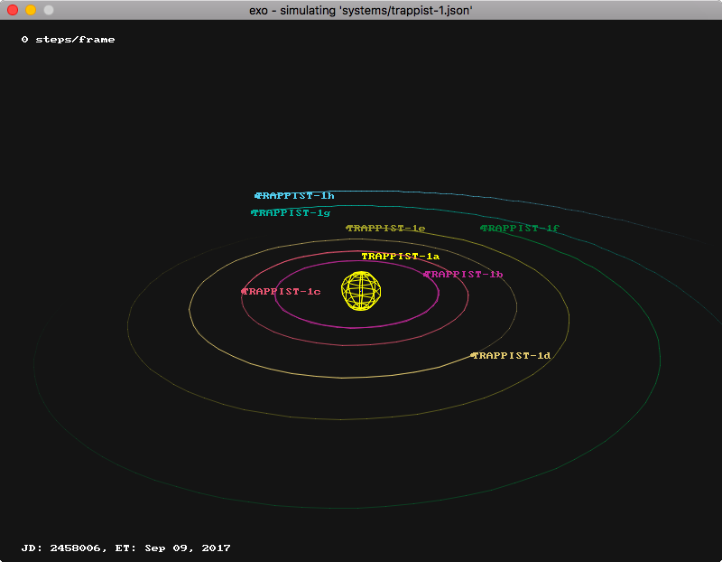

# Exo 

Exo is a simple n-body orbit integrator written as a proof-of-concept. It uses verlet integration,
is neither optimised nor really accurate, but it works on a basic level. Visualisation is done using
SDL for basic 2D drawing, and a custom software 3D renderer. Exo is released under MIT license.



## Installing Exo

Exo requires a modern C++ compiler (tested with Clang), make, SDL2 and SDL2_gfx for rendering.

````bash
# Install dependencies

$ brew install sdl2 sdl2_gfx                # macOS/Homebrew
$ sudo apt-get intsall sdl2-devel sdl2_gfx  # GNU/Linux/ish
````

# Build exo

````bash
$ git clone git@github.com:amyinorbit/exo.git
$ cd exo
$ make install -j4
````

## Running Exo

Exo uses JSON files to define the initial state of the simulation (keplerian orbital elements at a
given epoch):

````json
{
    "star": {
        "name": "Sol",
        "mass": 1.0
    },
    "bodies": [
        {
            "name": "Mercury",
            "mass": 0.055,
            "sma": 0.38709893,
            "ecc": 0.20563069,
            "inc": 7.00487,
            "raan": 48.33167,
            "arg": 29.12478,
            "ma": 174.79439,
            "color": "PURPLE"
        },
    ]
}
````

To start a simulation call Exo from a command line:

````bash
$ exo system.json
````

You can also pass multiple options to Exo through command line arguments to tailor the simulation

````bash
$ exo -h

usage: exo [-w width] [-h height] [-f] [-s step] json_file 

	-w,--width:	window width (defaults to 800 pixels)
	-h,--height:	window height (defaults to 600 pixels)
	-s,--step:	time increment between integration steps (defaults to 60 seconds)
	json_file:	json solar system file
````

